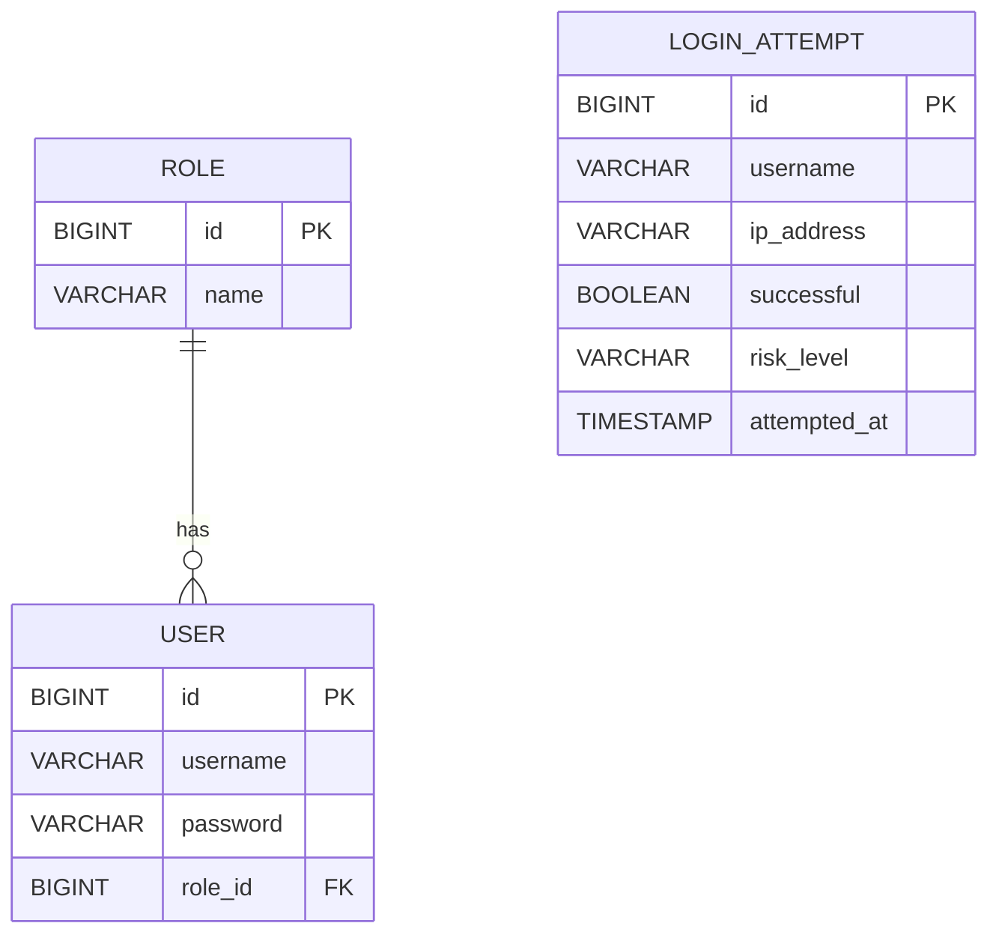

# Login Risk Monitor

Security-focused web application that records authentication attempts, assigns a risk level and provides role-based login monitoring.

Developed as a final project for Coding Factory 9 at the Athens University of Economics and Business (AUEB).

## Live Demo

Application: https://login-risk-monitor.onrender.com

> Note: The live demo uses free-tier hosting. The first request after a period of inactivity may take up to a minute while the service starts.

## Features

- Records successful and failed login attempts.
- Stores username, IP address and timestamp.
- Classifies attempts as `LOW`, `MEDIUM` or `HIGH` risk.
- Provides overall login statistics for administrators.
- Provides personal login history and statistics for regular users.
- Supports `ADMIN` and `USER` authorization.
- Allows administrators to view users and create new accounts.
- Stores passwords using BCrypt.
- Uses Flyway for database migrations.
- Includes unit and application-context tests.

## Technology Stack

- Java 21
- Spring Boot 3
- Spring Security
- Spring Data JPA / Hibernate
- Thymeleaf
- MySQL 8
- Flyway
- Maven
- JUnit 5
- Mockito
- H2
- Docker
- Docker Compose

## Architecture

The application uses server-side rendering with Thymeleaf and a layered architecture:

```text
Controller -> Service -> Repository -> MySQL
                 |
                 -> DTO / Mapper
```

Main package structure:

```text
src/main/java/com/loginriskmonitor
├── controller
├── domain
├── dto
├── exception
├── mapper
├── repository
├── security
└── service
```

Spring MVC handles the page flow, Thymeleaf renders the frontend and Spring Security handles authentication and authorization.

## Domain and Risk Logic

The main domain objects are:

- `User`
- `Role`
- `LoginAttempt`
- `RiskLevel`

A user belongs to either the `ADMIN` or `USER` role.

Each login attempt stores the submitted username, IP address, result, risk level and timestamp.

### Domain Model



`LoginAttempt` stores the submitted username instead of requiring a direct relationship with `User`. This allows failed login attempts to be recorded even when the submitted username does not exist.

### Risk Levels

```text
Successful login              -> LOW
First or second failed login  -> MEDIUM
Third and later failed login  -> HIGH
```

Failed attempts are calculated using the stored login history for the submitted username.

## Running Locally

### Requirements

- JDK 21
- MySQL 8

The default development profile connects to:

```text
localhost:3306/login_risk_monitor
```

Set your local MySQL password as an environment variable before starting the application.

### Windows PowerShell

```powershell
$env:DB_PASSWORD="your_mysql_password"
.\mvnw.cmd spring-boot:run
```

### macOS / Linux

```bash
export DB_PASSWORD="your_mysql_password"
./mvnw spring-boot:run
```

Open:

```text
http://localhost:8080
```

## Running with Docker

Docker Compose starts both the Spring Boot application and MySQL.

Create a `.env` file in the project root:

```env
DB_USERNAME=loginrisk
DB_PASSWORD=your_database_password
MYSQL_ROOT_PASSWORD=your_root_password
```

The `.env` file is excluded from Git through `.gitignore`.

Start the application:

```bash
docker compose up --build
```

Open:

```text
http://localhost:8080
```

Stop the containers:

```bash
docker compose down
```

To also remove the local database volume:

```bash
docker compose down -v
```

## Demo Accounts

| Role | Username | Password |
| --- | --- | --- |
| ADMIN | `admin` | `Admin123!` |
| USER | `user` | `User123!` |

These accounts are intended for local demonstration only and should be changed or removed in a real production environment.

Administrators can also create new `ADMIN` or `USER` accounts through the application. New passwords are stored using BCrypt.

## Testing

Run all tests.

### Windows

```powershell
.\mvnw.cmd clean test
```

### macOS / Linux

```bash
./mvnw clean test
```

The test profile uses an in-memory H2 database, so MySQL is not required for the tests.

## Building and Deployment

Build the executable JAR.

### Windows

```powershell
.\mvnw.cmd clean package
```

### macOS / Linux

```bash
./mvnw clean package
```

The generated JAR is stored in:

```text
target/
```

For production, activate the `prod` profile:

```text
SPRING_PROFILES_ACTIVE=prod
```

and provide the database configuration through environment variables:

```text
DB_URL
DB_USERNAME
DB_PASSWORD
```

Database passwords are not stored in the repository.

Flyway runs the database migrations when the application starts, while Hibernate validates the resulting schema.

## Known Limitations

- Risk calculation uses the complete stored login history rather than a rolling time window.
- Login-attempt lists are not currently paginated.
- Rate limiting and account lockout are not implemented.
- When running behind a reverse proxy, additional forwarded-header configuration may be required to capture the original client IP address.